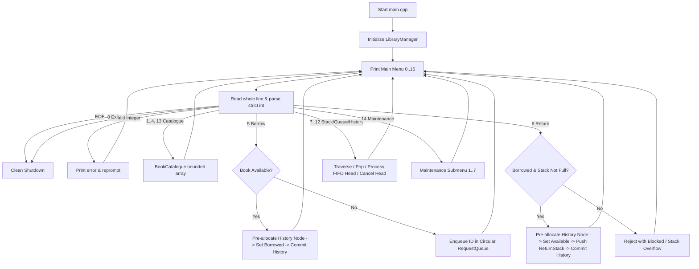

# Verified System & Circulation Flowchart

## Main Console Loop

```mermaid
flowchart TD
    A[Start main.cpp] --> B[Initialize LibraryManager]
    B --> C[Print Main Menu 0..15]
    C --> D[Read whole line & parse strict int]
    D -->|EOF| Z[Clean Shutdown]
    D -->|Invalid Integer| E[Print error & reprompt]
    E --> C
    D -->|0 Exit| Z
    D -->|1..4, 13 Catalogue| F[BookCatalogue bounded array]
    D -->|5 Borrow| G{Book Available?}
    G -->|Yes| H[Pre-allocate History Node -> Set Borrowed -> Commit History]
    G -->|No| I[Enqueue ID in Circular RequestQueue]
    D -->|6 Return| J{Borrowed & Stack Not Full?}
    J -->|Yes| K[Pre-allocate History Node -> Set Available -> Push ReturnStack -> Commit History]
    J -->|No| L[Reject with Blocked / Stack Overflow]
    D -->|7..12 Stack/Queue/History| M[Traverse / Pop / Process FIFO Head / Cancel Head]
    D -->|14 Maintenance| N[Maintenance Submenu 1..7]
    F --> C
    H --> C
    I --> C
    K --> C
    L --> C
    M --> C
    N --> C
```
